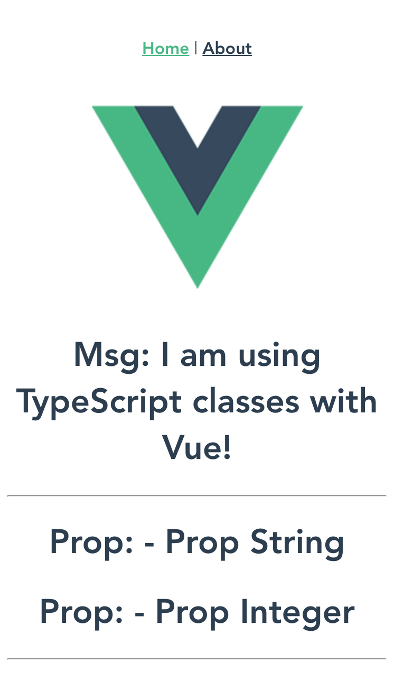

# Vue-Typescript - 3 Steps Only!

[](https://greenkeeper.io/)

## Project setup
<div align=center>
    
</div>
### Project setup :
```
npm install -g @vue/cli
```

### Install template loader, Typescript can stream at webpack

```
npm install --save vue-template-loader webpack-stream
```

### Start Serve

```
npm run serve
```